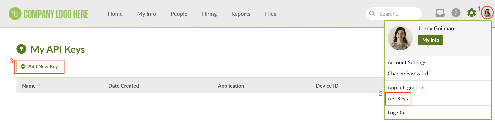
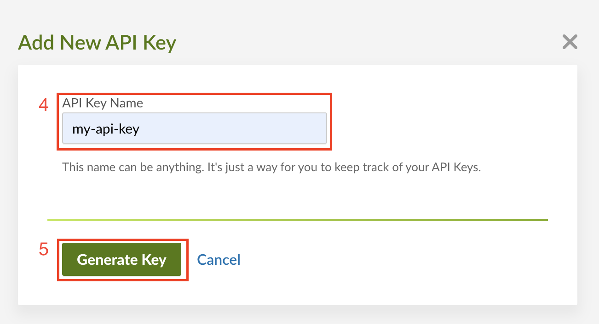
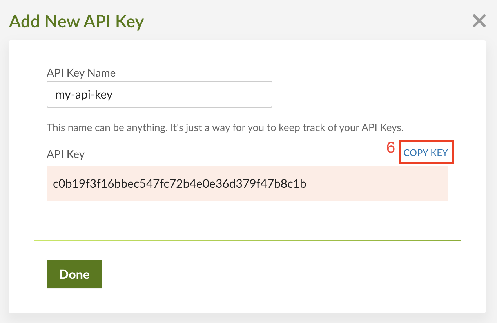
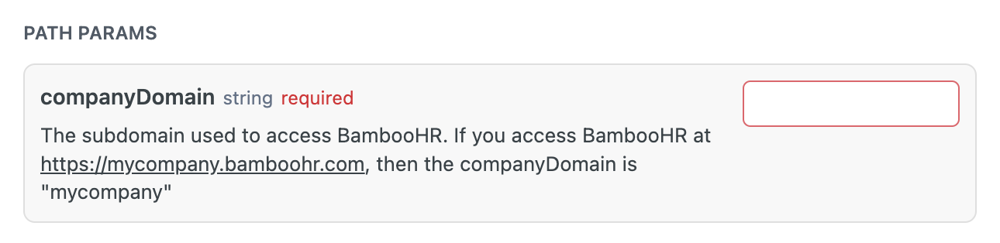
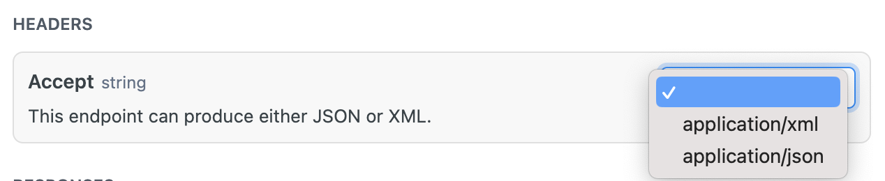
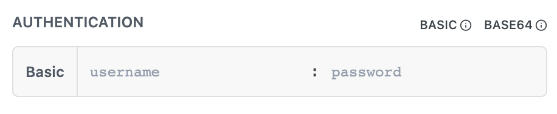
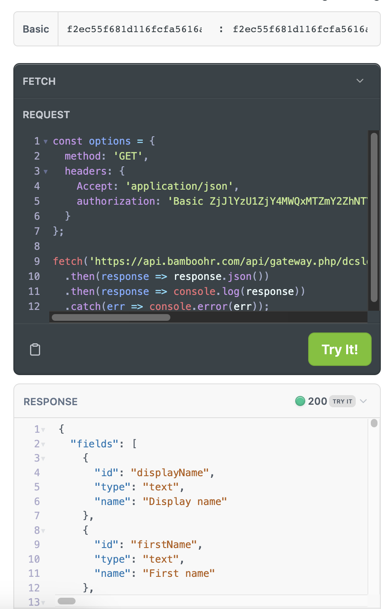

# BambooHR integration

### Important Links

- BambooHR testing web: https://dcslguidesmithstest.bamboohr.com/

- BambooHR API documentation: https://documentation.bamboohr.com/docs

## Create an API Key

1º - Go to `Profile`

2º - Click on `API Keys`

3º - Click on `Add New Key`

4º - Write your `API Key name`

5º - Click on `Generate Key`

6º - Copy the `API Key` generated

## Example to get employees directory

API Documentation: https://documentation.bamboohr.com/reference/get-employees-directory-1

1º - Fill the companyDomain: `https://{companyDomain}.bamboohr.com/`

2º - Select if you want your response with JSON/XML format:

3º - Fill the username and password with you API Key:

4º - Try the endpoint and get the response!

